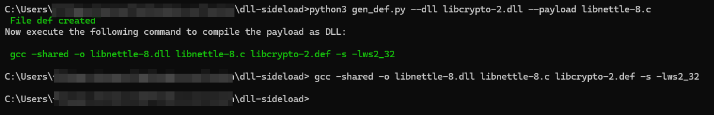

# DLL Side-loading made simple

## Credits
This work is inspired by the following: https://github.com/tothi/dll-hijack-by-proxying, that I encourage you to read in case you don't know how this attack works.
## Lab setup
    FileZilla Client
      Version:          3.67.1
    Operating system:
      Name:           Windows 11 (build 22631), 64-bit edition
      Version:        10.0
      Platform:       64-bit system
## Requirements
- Python3 with pip
- Pefile

         pip3 install pefile  
- GCC compiler. I use MSYS2 MINGW32, in case you can follow [this tutorial](https://code.visualstudio.com/docs/cpp/config-mingw) to install it.

## Lab scenario
We must identify a DLL that is loaded by Filezilla.exe. There are many tools\techniques to accomplish the task, in my case I used Process Hacker:

I dediced to exploit <b>C:\Program Files\FileZilla FTP Client\libnettle-8.dll</b> as target DLL. First I renamed the library as <b>libcrypto-2.dll</b> (you can choose the name you prefer, just keep it stealth :)). We can verify that the DLL is loaded by Filezilla client executing filezilla.exe; you will get the following error about missing libnettle-8.dll:

The error confirm that we can take advantage of this DLL to perform a side-loading attack.

In this scenario we are going to perform the following actions:
- export the function contained in the original libnettle-8 DLL (now renamed as libcrypto-2) inside our malicious payload: libnettle-8.c
- compile our payload containing a reverse shell as the original payload: libnettle-8.dll

The python script takes care to create the def file containing the exported function, then return the <b>gcc</b> command to compile the payload as original DLL (libnettle-8):

The final step is to copy our malicious DDL into Filezilla's home folder. Execute filezilla.exe and you should get a powershell back to your local machine:

## Lab 2

    FortiClient VPN
        7.2.3.0929
    Operating system:
      Name:           Windows 11 (build 22631), 64-bit edition
      Version:        10.0
      Platform:       64-bit system

### Identify a suitable DLL using processhacker

## Note
I also tried to implement gcc's execution from the python script directly, using subprocess, but the resulting DLL was smaller, compared to the one eventually created issuing the command from the shell. Indeed once executed, an error related the missing entry point was thrown. At the moment I don't know what is the problem. Any help in this sense is really appreciated</i>.

